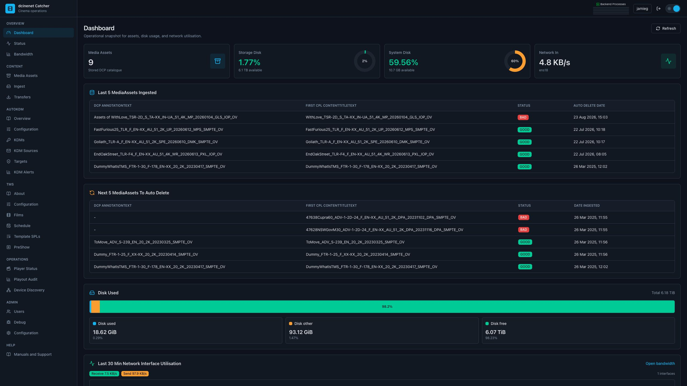
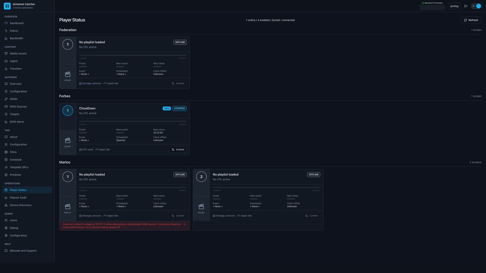
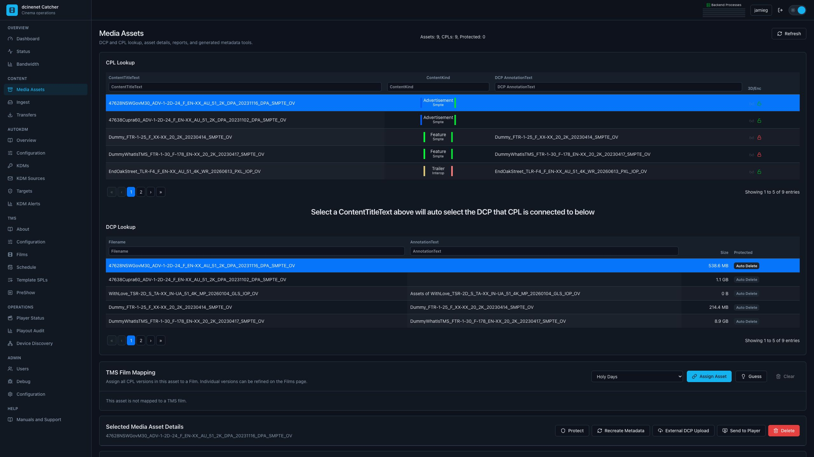
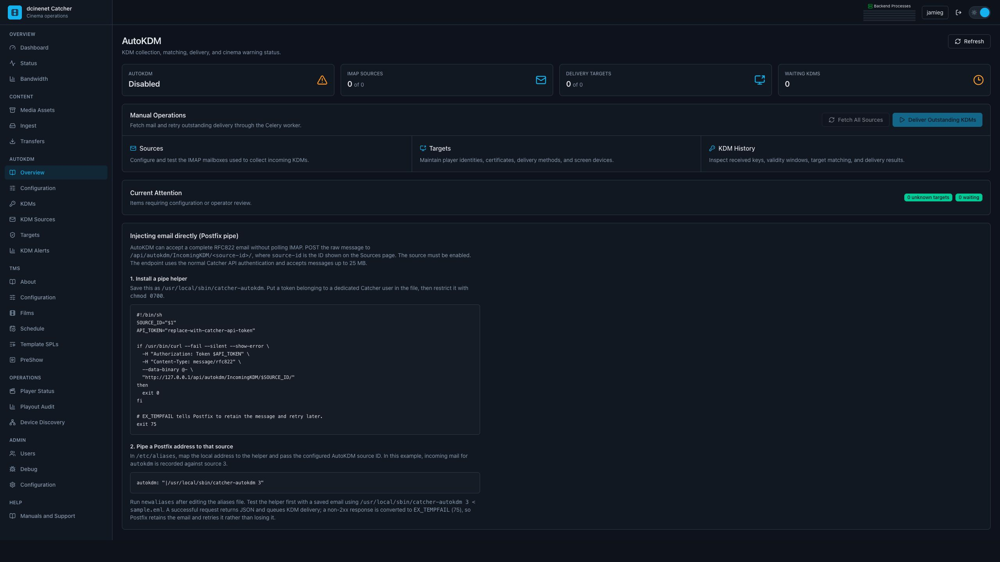
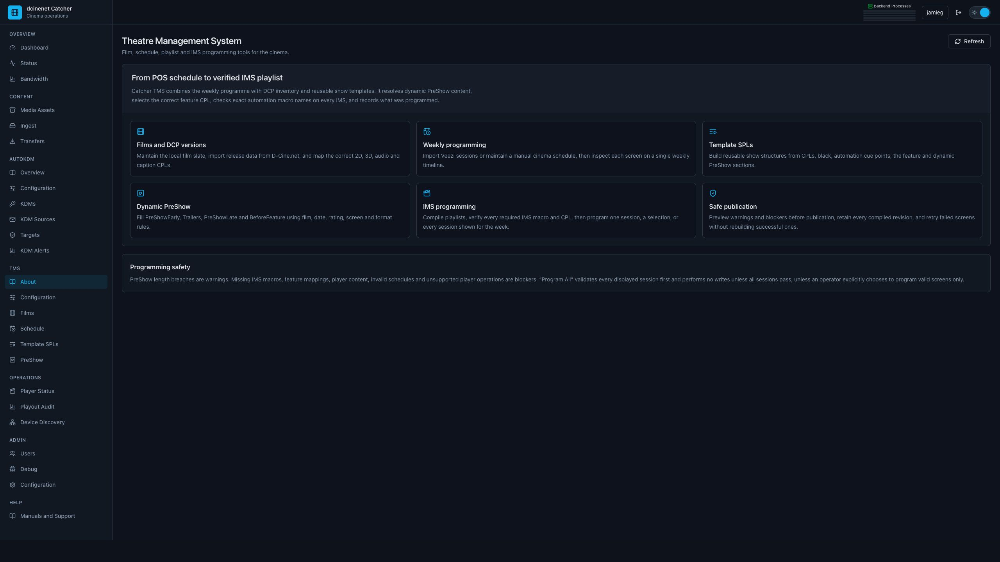

# Cinema Catcher 4

Free cinema operations, content management, AutoKDM, monitoring, audit, and
theatre-management tools for exhibitors.



> **Upgrading an existing Catcher 3 installation?** Do not replace the Compose
> file or run `update.sh` yet. Catcher 4 moves from PostgreSQL 13 to PostgreSQL
> 18 and requires a controlled database migration. Follow
> [Upgrading from Catcher 3 — SSH login and exact command walkthrough](UPGRADING_FROM_V3.md).
> The guide includes an already-stopped v3 stack, verified cold backups,
> explicit old-installation paths, database migration, v4 cutover and rollback.
> Do not run the upgrade script without its `--compose-file` and `--env-file`
> arguments; cloning the v4 helper alone does not upgrade the site.

The previous installation guide is retained as
[README_V3.md](README_V3.md) for historical reference. It must not be used for
a new Catcher 4 installation.

## What Cinema Catcher does

Cinema Catcher is a site-level cinema server created by an exhibitor to reduce
the repetitive technical work involved in operating digital cinemas. Features
can be enabled independently: a site may use only the LMS, only AutoKDM, only
player monitoring, or the complete toolset.

The project is particularly useful to independent and regional cinemas that do
not have a full commercial TMS. It can also operate beside an existing TMS as
an independent content library, KDM safety net, audit system, or monitoring
tool.

Cinema Catcher is actively developed. Validate workflows against the player,
projector, POS, and network versions used at each site before relying on an
automation function unattended.

## What is new in Catcher 4

- A new Svelte interface is now the primary interface. It is responsive, uses
  the full browser width, defaults to the Midnight Slate dark theme, and has a
  light/dark switch beside sign-out.
- Real-time backend-process reporting shows queued work, stages, progress, and
  failures directly in the top bar.
- Player Status has denser fixed-width screen cards, multi-site grouping,
  direct IMS-control links, poster support, reconnect/backoff handling, and a
  dedicated polling queue.
- AutoKDM has more resilient IMAP processing, persistent message UID memory,
  configurable email-age limits and deletion, expired-KDM rejection, clearer
  target/asset reporting, and a dedicated eight-process delivery queue.
- Media Assets now includes deeper CPL structure and QC information, previews,
  video bitrate, audio waveform/loudness data, film mapping, player ingest, and
  orphaned/broken asset management.
- Ingest has explicit source/device/queue views, clearer failures, passive
  validation, XML cleanup before ClairMeta, and improved duplicate handling.
- Network bandwidth collection has a dedicated monitor process with retained
  raw and roll-up history.
- Device Discovery and Playout Audit have been rebuilt in the new interface.
- A new TMS workspace adds films, Veezi/manual scheduling, reusable template
  SPLs, dynamic PreShow rules, IMS macro validation, and controlled programming.
- PostgreSQL 18, Redis 8, Debian Trixie application images, Django 6, and
  isolated Celery queues form the updated service platform.

## Interface overview

### Player and site operations



Player Status groups screens by cinema, shows the active SPL/CPL, progress,
automation state, storage and ingest activity, and provides player controls
where supported. A screen number links directly to that IMS control interface.
Offline players are backed off so they do not consume all polling capacity.

### Content library and QC



The LMS ingests DCPs from attached media, network/FTP sources, and uploaded
content. Assets are checked with ClairMeta and presented as searchable DCP/CPL
records. Operators can protect assets from automatic deletion, inspect detailed
metadata and QC products, map assets to films, and send content to players.

### AutoKDM



AutoKDM collects KDMs from IMAP sources or a direct RFC822 email endpoint,
matches certificate targets, filters unusable or expired keys, and queues
delivery without allowing an offline player to block other screens. KDM Alerts
compare scheduled content, the asset inventory, player content, and KDM
validity, then produce advance warning reports.

### Theatre Management System



The TMS section is the newest major area. It supports manual or Veezi-derived
films and sessions, DCP-to-film mapping, weekly screen timelines, template SPLs,
dynamic PreShow buckets, 2D/3D playlist selection, and IMS programming checks.
Treat TMS programming as a supervised workflow until it has been validated with
the exact IMS software used at the site.

## Feature map

| Area | Main capabilities |
| --- | --- |
| Dashboard and Status | Storage, recent assets, deletion queue, service status, network utilisation and retained bandwidth graphs |
| LMS / Media Assets | DCP ingest, ClairMeta QC, searchable DCP/CPL catalogue, asset protection and cleanup, FTP/Samba access, metadata and preview products, film mapping and player ingest |
| Ingest | Local devices, filesystem/network/FTP sources, cached scans, queues, duplicate detection, automatic source polling and actionable failures |
| AutoKDM | IMAP and piped email ingest, email-age policies, KDM validity filtering, certificate matching, player/FTP delivery, retry queues, history and reports |
| KDM Alerts | Schedule-to-CPL-to-KDM checks, player asset checks, configurable recipients and retained report history |
| Player Status | Multi-site monitoring, schedule state, SPL/CPL progress, storage, ingest state, controls and direct IMS links |
| Playout Audit | Player log collection, searchable records, scheduled reports, CSV/email/API output and retention controls |
| Device Discovery | Passive network discovery, version inventory, comparison, targeted scans and change reports |
| TMS | Films, DCP mapping, Veezi/manual schedules, weekly programming, template SPLs, dynamic PreShow and IMS macro validation |
| Administration | Users, global configuration, email, TMS/FTP settings, debug tasks, background-process history and dark/light theme |

Player integration exists for Dolby/Doremi, GDC, Qube, and Barco families, but
individual capabilities vary by vendor, model, and software release. Always
test certificate retrieval, status, audit, KDM ingest, content ingest, control,
and TMS programming separately for each deployed player version.

## Architecture

The installation is a Docker Compose application. Persistent cinema data lives
outside the containers below `/opt/catcher`.

| Service | Purpose |
| --- | --- |
| `pgdatabase` | PostgreSQL 18 application database |
| `redis` | Celery broker, real-time state, locks and caches |
| `backend` | Django API and application services through Gunicorn |
| `backendc` | Daphne ASGI/WebSocket service |
| `worker` | General background tasks |
| `worker_mon` | Isolated player-status polling queue |
| `worker_kdm` | Isolated KDM delivery queue, default concurrency 8 |
| `beat` | Database-backed periodic scheduler |
| `network-monitor` | Host interface counters and bandwidth roll-ups |
| `nginx` | Web interface and reverse proxy |
| `ftpserver` | Player-facing and LMS FTP service |
| `aria2server` | Managed content transfers |
| `samba` | Readable DCP library share |
| `netbird` | Optional remote access profile; disabled by default |

## Requirements

### Recommended server

- Ubuntu Server 24.04 LTS or later, minimal installation.
- 64-bit x86 processor with at least 4 physical cores; 8 or more threads are
  recommended for a multi-screen site.
- 8 GB RAM minimum; 16 GB or more is recommended when using LMS QC, TMS,
  multiple players, or a desktop environment.
- 100 GB of free system storage for the operating system, containers, database,
  temporary work and upgrades. A 256–500 GB SSD is a practical system disk.
- Separate high-capacity storage mounted at `/opt/catcher/storage` when using
  the LMS. Use redundant storage or a reliable NAS for production content.
- Two network interfaces are recommended: one for the business/Internet network
  and one with a static address on the isolated projection network.

Do not allow the PostgreSQL data, Redis data, or the DCP library to fill their
filesystems. Database upgrades temporarily require room for the old cluster,
the new cluster, and a logical backup at the same time.

### Docker

Install Docker Engine and the Compose plugin from Docker's official Ubuntu APT
repository:

<https://docs.docker.com/engine/install/ubuntu/>

Verify the result:

```bash
sudo docker version
sudo docker compose version
```

The legacy Python command `docker-compose` is not used. Commands in this guide
use `docker compose`.

## Fresh Catcher 4 installation

These steps are for a new server with no Catcher 3 database. Existing v3 sites
must use [UPGRADING_FROM_V3.md](UPGRADING_FROM_V3.md).

### 1. Install supporting packages

```bash
sudo apt update
sudo apt install -y git ca-certificates curl
```

### 2. Prepare persistent directories

```bash
sudo mkdir -p \
  /opt/catcher/storage \
  /opt/catcher/postgresql/18 \
  /opt/catcher/redis \
  /opt/catcher/ftpserver \
  /opt/catcher/aria2server \
  /opt/dcinenet/storage

sudo chmod 755 /opt/catcher/postgresql/18
```

Mount the content filesystem or NAS at `/opt/catcher/storage` before starting
Catcher. Confirm it is the intended filesystem:

```bash
findmnt /opt/catcher/storage || df -h /opt/catcher/storage
```

### 3. Download the installer

```bash
cd /opt
sudo git clone https://github.com/jamiegau/cinema-catcher-app.git
cd /opt/cinema-catcher-app
```

### 4. Configure the site

Create `.env` from the supplied example:

```bash
sudo cp .env.example .env
sudo nano .env
```

Set:

- `LOCAL_TIMEZONE_NAME` to an IANA timezone such as `Australia/Melbourne`;
- `CATCHER_HOSTNAME` to a unique name such as `chain-site-catcher`;
- `EXPOSED_IP_PROJECTION_NETWORK` to this server's static projection-network
  address; and
- `IN_PRODUCTION=True` for normal operation.

Review `database.env` before first startup. It contains the PostgreSQL database,
user and password used internally by Catcher. A new installation may replace
the supplied password before PostgreSQL is initialised. Do not change these
values later without also migrating the database credentials.

NetBird is optional and is not started by the default profile. To use it, set
`NB_SETUP_KEY` in `.env`, review the NetBird URLs in `docker-compose.yml`, then
start the `netbird` profile explicitly.

Validate the final Compose configuration:

```bash
sudo docker compose config --quiet
```

### 5. Pull images and initialise Catcher

```bash
sudo docker compose pull
sudo docker compose up -d pgdatabase redis

sudo docker compose run --rm backend python3 ./manage.py migrate
sudo docker compose run --rm backend python3 ./manage.py migrate --check
sudo docker compose run --rm backend python3 ./manage.py check
sudo docker compose run --rm backend python3 ./manage.py catcher_setup

sudo docker compose up -d
sudo docker compose ps --all
```

For optional NetBird access:

```bash
sudo docker compose --profile netbird up -d
```

### 6. Sign in and secure the installation

Open `http://<catcher-server-address>/` in a current browser.

The initial account created by `catcher_setup` is normally:

```text
Username: admin
Password: admin
```

Change this password immediately under **Admin → Users**. Create named accounts
for operators and administrators rather than sharing the initial account.

### 7. Initial application setup

Work through the following areas in order:

1. **Admin → Configuration** — site identity, storage, email, FTP/TMS and global
   task settings.
2. **AutoKDM → Targets** — each screen's player address, vendor, credentials,
   serial/certificate, enabled functions and screen number.
3. **Content → Ingest** — ingest devices and network sources.
4. **AutoKDM → Configuration and KDM Sources** — only if AutoKDM will be used.
5. **Operations → Device Discovery** — define passive/targeted discovery ranges.
6. **Operations → Player Status** — confirm every enabled player reports without
   blocking healthy screens.
7. **TMS → Configuration** — only after player and content mappings are correct.

Detailed operator help is available from **Manuals and Support** inside Catcher.

## Updating an existing Catcher 4 installation

Create a database backup first, then run:

```bash
cd /opt/cinema-catcher-app
sudo git pull --ff-only
sudo ./update.sh
```

`update.sh` refuses to run when it detects the normal Catcher 3/PostgreSQL 13
data path. For v4 it pulls images, stops database-writing application services,
applies and checks migrations, runs Catcher setup, restarts the stack, and
removes only dangling images. It does not prune persistent volumes or remove
rollback images.

## Backups

Back up both the database and persistent service data. The DCP library may be
protected by the storage system's own snapshots, but the PostgreSQL database is
still required to preserve the catalogue and configuration.

Example PostgreSQL 18 backup:

```bash
cd /opt/cinema-catcher-app
set -a
. ./database.env
set +a

backup_dir="/opt/catcher/backups/$(date +%Y%m%d-%H%M%S)"
sudo mkdir -p "$backup_dir"
sudo chmod 700 "$backup_dir"

sudo docker compose exec -T pgdatabase \
  pg_dump -U "$POSTGRES_USER" -d "$POSTGRES_DB" -Fc |
  sudo tee "$backup_dir/catcher-postgres18.dump" >/dev/null
sudo sha256sum "$backup_dir/catcher-postgres18.dump" |
  sudo tee "$backup_dir/catcher-postgres18.dump.sha256"
sudo sha256sum -c "$backup_dir/catcher-postgres18.dump.sha256"
```

Also back up `.env`, `database.env`, `docker-compose.yml`,
`/opt/catcher/redis`, `/opt/catcher/ftpserver`, and
`/opt/catcher/aria2server`. Restrict backup access because configuration files
contain operational credentials.

## Useful commands

```bash
cd /opt/cinema-catcher-app

# Container state
sudo docker compose ps --all

# Start or reconcile the complete stack
sudo ./start.sh

# Follow all logs, or one service
sudo ./TAIL.sh
sudo ./TAIL.sh backend
sudo ./TAIL.sh worker_kdm

# Check application and migrations
sudo docker compose exec -T backend python3 manage.py check
sudo docker compose exec -T backend python3 manage.py migrate --check

# Check PostgreSQL and Redis
sudo docker compose exec -T pgdatabase pg_isready
sudo docker compose exec -T redis redis-cli ping

# Stop containers without deleting bind-mounted data
sudo docker compose down
```

## Published ports

| Port | Service |
| --- | --- |
| TCP 80 | Web interface and API |
| TCP 20–21, 21100–21120 | FTP and passive FTP range |
| TCP 139, 445 and UDP 137–138 | Samba DCP share |
| TCP 16888 | aria2 JSON-RPC |
| TCP 8000 / 8001 | Backend and ASGI diagnostic access |
| TCP 5432 | PostgreSQL; restrict this at the host firewall |

Only expose services to networks that need them. In particular, do not publish
PostgreSQL, aria2 RPC, FTP, or player networks to the public Internet.

## Troubleshooting

### The web page does not open

```bash
sudo docker compose ps --all
sudo docker compose logs --tail=100 nginx backend backendc
curl -fsS http://127.0.0.1/api/catcher/GetVersion/
```

If nginx reports an upstream lookup failure, confirm both `backend` and
`backendc` are running, then recreate nginx with `docker compose up -d nginx`.

### A background action appears not to start

Open **Backend Processes** in the top bar, then check the correct worker:

```bash
sudo docker compose logs --tail=150 worker
sudo docker compose logs --tail=150 worker_mon
sudo docker compose logs --tail=150 worker_kdm
sudo docker compose logs --tail=150 beat
```

General work, status polling, and KDM delivery deliberately use separate queues.

### Redis says a task is already queued

Do not assume flushing Redis is the correct fix. A database-backed task or an
active Celery worker may still own the operation. Inspect Backend Processes and
worker logs first. Restarting or flushing infrastructure can hide the cause and
may discard useful state.

### A player is offline

Confirm routing from the Catcher host and from the backend container, then test
the configured player credentials. Player Status monitoring and AutoKDM delivery
are separate enable flags; disabling status display does not disable AutoKDM.

### Storage permissions fail

Confirm the expected filesystems are mounted and accessible before changing
permissions:

```bash
findmnt /opt/catcher/storage
sudo docker compose exec -T backend ls -ld /opt/catcher/storage
sudo docker compose exec -T redis ls -ld /data
```

Redis must be able to write its persistent `/data` mount. If its logs report
`Failed opening the temp RDB file` or `stop-writes-on-bgsave-error`, repair the
host directory using the UID and GID from the running image, then verify a
snapshot:

```bash
redis_uid="$(sudo docker compose exec -T redis id -u redis)"
redis_gid="$(sudo docker compose exec -T redis id -g redis)"
sudo chown -R "${redis_uid}:${redis_gid}" /opt/catcher/redis
sudo docker compose exec -T redis redis-cli BGSAVE
sudo docker compose exec -T redis redis-cli INFO persistence |
  grep rdb_last_bgsave_status
```

## Documentation and support

- Current installation guide: this README.
- Catcher 3 upgrade: [UPGRADING_FROM_V3.md](UPGRADING_FROM_V3.md).
- Historical v3 install guide: [README_V3.md](README_V3.md).
- Historical transfer and AutoKDM notes:
  [Manual.md](Manual.md) and [Manual_AutoKDM.md](Manual_AutoKDM.md).
- Current operator manuals: **Manuals and Support** inside the running v4 UI.
- Bugs and feature requests: use the GitHub issue tracker for this project.

When reporting a problem, include the Catcher version, player vendor/software,
the affected service, the relevant log excerpt, and whether the problem can be
reproduced without production playback.
